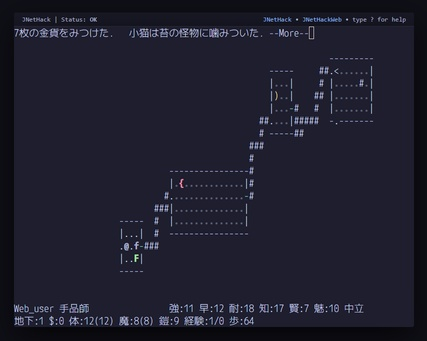

# JNetHack-Web



ようこそ! This is an unofficial browser-based version of [JNeckHack](http://www.jnethack.org/). It is intended to be used together with a pop-up dictionary plugin of your choice (tested with Yomitan). Made for Japanese language learners.

## How To Play

You can play the current build directly in your browser using the link below:<br>
[https://zegalur.github.io/jnethack-web/](https://zegalur.github.io/jnethack-web/)

## How To Build

1. Make sure all submodules are downloaded:
```bash
git submodule update
```
2. Install `clang` and 32-bit development libraries:
```bash
sudo apt install libc6-dev:i386 libtinfo-dev:i386
```
3. [Install and activate](https://emscripten.org/docs/getting_started/downloads.html#installation-instructions-using-the-emsdk-recommended) the `emscripten` toolchain.

4. Build the native binaries (game data files are auto-generated during installation):
```bash
./build-native.sh
```
5. Locate the JNetHack binary and data files. Specifically, you will need:
```
license
logfile
nhdat
perm
record
recover
symbols
sysconf
xlogfile
```
On Linux, these are usually located in: 
```
~\nh\install\games\lib\jnethackdir
```

6. Copy these files into the `jnethack-files` folder.

7. Run: 
```bash
make BUILD=release
```
This will build JNetHack-Web and place it inside the release folder (`make BUILD=debug` for a debug build).

8. To play locally, run: 
```bash
./run-server.sh
```
(*Python* is required.)

## Aknowledgements

This project was made possible thanks to the great tools and projects created by others:

1. [NetHack](https://www.nethack.org/)
2. [JNetHack](http://www.jnethack.org/)
3. [Emscripten](https://emscripten.org/)
4. [xterm.js](https://xtermjs.org/)
5. [xterm-pty.js](https://github.com/mame/xterm-pty)
6. ... and many-many more.

## License

This project is a web port and wrapper around existing software, and therefore involves multiple licenses:

- *NetHack*: Distributed under the NetHack General Public License (NGPL). See the license file included with NetHack for details.
- *JNetHack*: Follows the same licensing terms as NetHack (NGPL), unless otherwise specified by its authors.
- The source code in *this repository* created by me is released under CC0.
- *Third-party assets* and libraries may have their own licenses attached.
